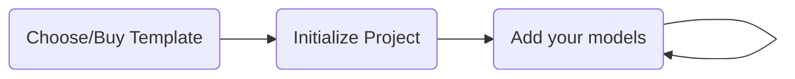

<style>

.box-container {
    @apply 
    grid grid-flow-col place-items-center
}

.box {
    @apply 
    h-40 w-65
    text-center justify-center flex flex-col
    rounded-2xl shadow-md
    bg-black text-white
    dark:bg-white dark:text-black
}

</style>

# PackBlock

Toolchain to develop applications rapidly & marketplace to distribute your architecture

<div class="absolute bottom-10">
  <span class="font-700">
    Alp Coker 
  </span>
</div>

<style>
p {
  font-size: larger !important;
}
</style>

---
layout: image-right
image: 'https://images.unsplash.com/photo-1518281361980-b26bfd556770?ixlib=rb-4.0.3&ixid=MnwxMjA3fDB8MHxwaG90by1wYWdlfHx8fGVufDB8fHx8&auto=format&fit=crop&w=1005&q=80'
---
# Problem

<br />
<br />
<br />
<br />
While developing data intensive applications, developers losing time by;

<br />
<br />
<br />

- 🧩 deciding architecture
- ⛓️ choosing dependencies
- 🎬 initializing project
- 📊 defining standardization
- 🔥 writing boilerplate code

---


# Solution

<br/>
<br/>
<span class="font-black">A toolchain</span> for developers to develop data intensive applications to:

<br/><br/>

<div class="box-container">

<div class="box">
<h1>initialize project</h1>
<p>full blown, ready to run</p>
</div>

<div class="box">
<h1>save time</h1>
<p>by not writing boilerplate code</p>
</div>

<div class="box">
<h1 class="title">be extensible</h1>
<p>no extra dependencies</p>
</div>

</div>

<style>
.box h1 {
@apply text-24px
}
.box p {
@apply text-12px
}
</style>

---


# Product

<br/><br/><br/><br/>



---

# Business Model

<br/><br/>

1. Develop well crafted premium templates to sell.
2. Marketplace to sell their own developed templates. (commission)
3. License sales of extra tools for enterprise usage.

<style>
li {
@apply
text-30px
p-20px
}
</style>
---

# Market Adoption

<br/><br/>

1. Toolchain's source codes are all open source.
2. Providing free templates for users to start using.
3. Developers can make money by creating their opinionated templates and expand the usage. 

<style>
li {
@apply
text-30px
p-20px
}
</style>
---

# Competition Advantages

<br/>

- Easy as Low/No Code platforms without depending any vendor.
- Powerful as Frameworks/Libraries without any dependency.
- Customization is much more available than both.

<style>
li {
@apply
text-30px
p-20px
}
</style>

---

# Commands 

## Install Suitable Templates

```bash
pb install [template-name-1] \
           [template-name-2] \
           ...
```

## Create project

```bash
pb new -n [project-name] \
       -t [template-name-1,template-name-2, ...]  
```

## Add model

```bash
pb model -n [model-name] \
         -t [model-type] \
         -f [feature-name] \
         -p [property-1-name]:[property-1-type] \
            [property-2-name]:[property-2-type] \
            [parent-model-id]:[parent-model-id-type]:[parent-model-display-property] \ 
            ...
```

--- 

# Todo App Sample

```bash
pb install api-httpservice \
           react-ant-pro \
           ...
```


```bash
pb new -n ToDoApp -t api-httpservice react-ant-pro
```

```bash
pb model -n Category 
         -t crud 
         -f TaskManagement 
         -p Name:string
```

```bash
pb model -n TaskItem 
         -t crud 
         -f TaskManagement  
         -p Name:string 
            CategoryId:int:Name
```

---
layout: image
image: ./ss/login.png
---


---
layout: image
image: ./ss/dashboard.png
---


---
layout: image
image: ./ss/category-1.png
---

---
layout: image
image: ./ss/category-2.png
---
 
---
layout: image
image: ./ss/task-item-1.png
---

---
layout: image
image: ./ss/task-item-2.png
---

---
layout: image
image: ./ss/task-item-3.png
---

---
layout: image
image: ./ss/task-item-4.png
---

--- 
layout: center
---
# Thanks
packblock.dev