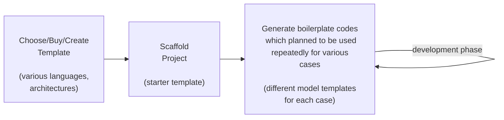

# Product

```mermaid {scale: 1.4}
graph LR;
    1["<br>Choose/Buy/Create<br>Template<br><br>(various languages,<br>architectures)"]-->2["<br>Scaffold<br>Project<br><br>(starter template)"]
    2-->3["<br>Generate boilerplate codes<br> which planned to be used<br> repeatedly for various cases<br><br>(different model templates<br>for each case)"]
    3-->|development phase|3
    
```

