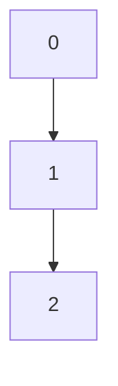

# Competition Advantages

 

- Easy as **Low/No Code platforms** without locking into any vendor.
- Powerful as **Frameworks/Libraries** without creating extra dependency.
- Customization & refactoring is much more available than both.

::right::

