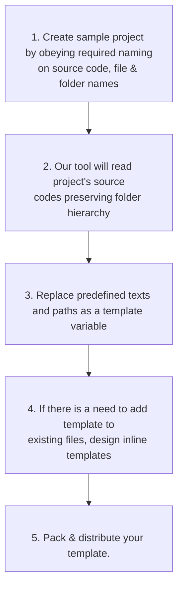

# Creating Templates

- We need a sample project with the some special naming requirements.

- You could easily update your whole template via that your reference project

::right::

```mermaid {scale: 0.8}
graph TB;
    0["<br>1. Create sample project by obeying required naming<br>on source code, file & folder names"] --> 1
    1["<br>2. Our tool will read project's source<br>codes preserving folder hierarchy"] --> 2
    2["<br>3. Replace predefined texts and paths as a template variable"] --> 3
    3["<br>4. If there is a need to add template to<br>existing files, design inline templates"] --> 4
    4["<br>5. Pack & distribute your template."]
```

