# Competition Advantages

- Easy as **Low/No Code platforms** without locking into any vendor.
- Powerful as **Frameworks/Libraries** without creating extra dependency.
- Customization & refactoring is much more available than both.

::right::

```mermaid {scale: 1.1}
graph LR;
    1["Low/No Code Platforms<br><br>🔺 productivity<br>🔻 ability"] -->0
    2["Frameworks/Libraries<br><br>🔺 ability<br>🔻 customization"] --> 0
    3["Custom Solution<br><br>🔺 customization<br>🔻 productivity"] --> 0
    0["PackBlock<br><br><br>✅ ability<br><br>✅ customization<br><br>✅ productivity<br><br>❗️design templates"]
```

